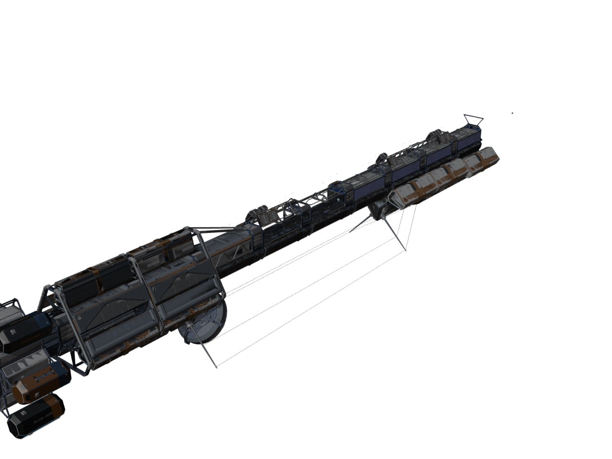
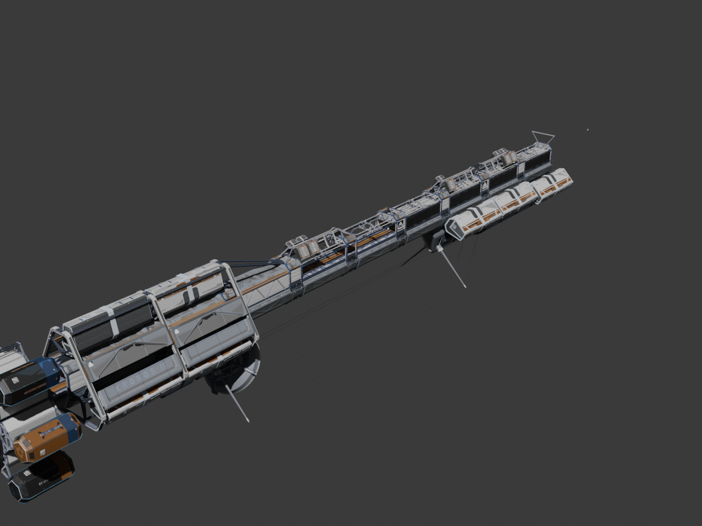
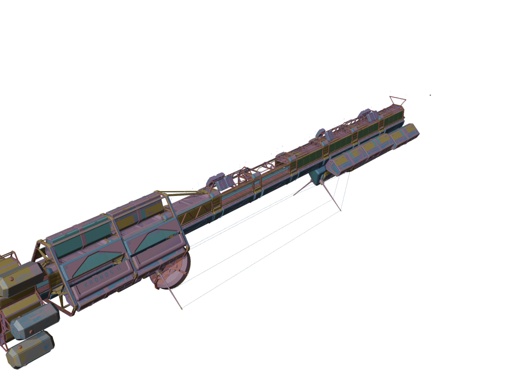
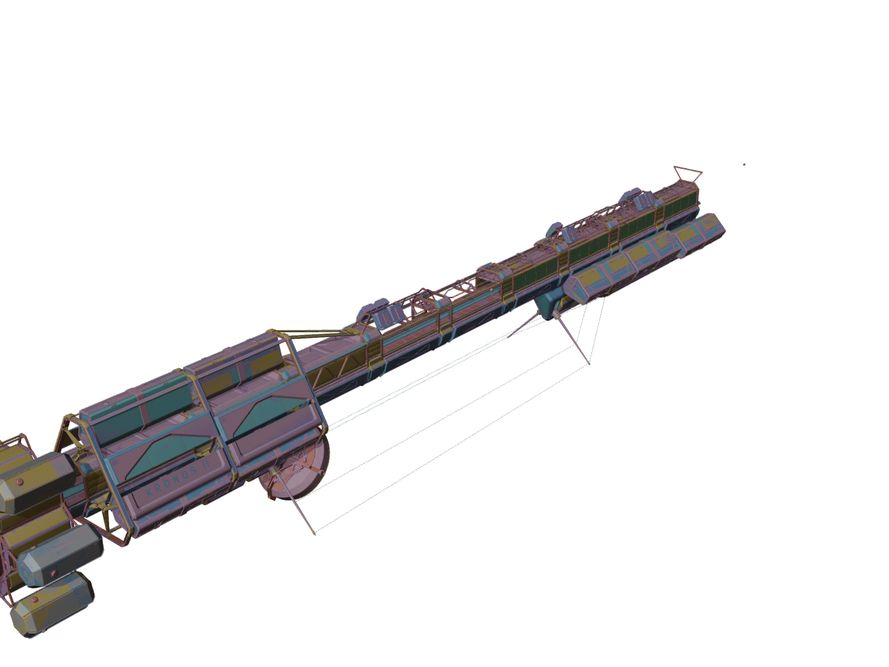

# Lone Echo Blender Importer

Import Lone Echo / NRadEngine meshes **and** whole scatter levels into Blender with
full vertex attributes, skeletons, per-draw materials, and **level-of-detail
selection**.

## Showcase

A whole static-scatter level, extracted to a portable package and imported into
Blender — 21,000+ placed instances over 1,000+ unique meshes, with per-material
base-color and normal maps:



The same level rendered through Blender's EEVEE engine, where the reconstructed
normal maps contribute surface detail:



### LOD selection

Lone Echo stores every level of detail of a prop as a **separate mesh with its own
instances**. Importing all of them stacks every level on top of every other. Here is
the same level with all levels placed (left, 21,394 instances / 6.30 M triangles)
and at LOD 0 alone (right, 8,288 instances / 3.67 M triangles) — the silhouette is
identical, because **61.3 % of those instances were lower-LOD duplicates**:

| all levels stacked | LOD 0 (the default) |
| --- | --- |
|  |  |

Both import operators expose a **LOD Level** option; see [docs/LOD.md](docs/LOD.md).

## Status — what works, and what does not

Be clear-eyed about this before you start: the value here is the tooling and the
dead ends already ruled out, not a claim that everything works. The open defects
are named below, not buried.

| | state |
| --- | --- |
| Geometry, UVs, vertex colors, **tangents**, **`color1`**, skin weights | **works** |
| Skeletons / armatures | **works** |
| **Character assembly** (actor node + named components) | **works** — new in 0.4.0 |
| Whole-level scatter placement (linked duplicates) | **works** |
| **Scene placement / level link** | **works** — new in 0.4.0 |
| Multi-material meshes (one slot per draw) | **works** |
| **LOD selection**, all three systems | **works** — the third is new in 0.4.0 |
| Base color + normal maps (incl. BC5 normal reconstruction) | **works** |
| **Material binding through the shader's RDEF** | **works** — new in 0.4.0 |
| **Corpus-wide role resolution with a refusal policy** | **works** — new in 0.4.0 |
| Transparency, emission, specular/F0, roughness+AO, layer blend masks | **works on `.lemesh`** |
| The same, on `.lescatter` whole-level imports | ⚠ **still base colour + normal only** |
| **Scene lights** | **imported — off by default**, `eEnableDiffuse` subset |
| Baked lightmaps (resource + per-instance stream) | **decoded, not auto-wired** |
| **Reflection probes** | **decoded and written as DDS; only mip 0 reaches a material** |
| **Normal maps on the shipped tangent basis** | **works** — new in 0.4.0, and it *fixed an inverted green channel on every normal map* |
| `eBlendTranslucent` | ⛔ **not implemented** |
| A duplicated back-face shell on characters | ⚠ **decoded and drawn; nothing has decided whether it should be** |
| **The exterior vista's shading model** (7 shadersets) | **works** — new in 0.5.0, ⛔ **and it is the one module you cannot reproduce from this repository** — see below |
| **Which directional light lights an exterior** | **settled** — new in 0.5.0: `ePrimaryDirLight`, not the brightest |
| The vista's per-frame terms (`fog`, `rim_gain`, `k_world_ambient*`) | ⛔ **not decodable from a level; free parameters at unfitted defaults** |

Eight of those deserve to be spelled out.

**Normal maps were running on the wrong tangent basis — all of them.** The
shipped `tangent` stream is decoded on **913 of 913** objects and, until 0.4.0,
was read by nothing. Because the importer flips V for Blender, Blender's derived
bitangent agreed with the shipped handedness on **0.0–0.8 % of loops**, which
inverts the green channel of every tangent-space normal map. 0.4.0 rebuilds the
TBN from the shipped basis in shader nodes and mixes to the old leg wherever the
stream is absent, so a mesh that ships no tangent renders exactly as before, per
pixel. See [docs/MATERIALS.md](docs/MATERIALS.md).

**`eBlendTranslucent` is unimplemented.** Materials that declare it fall back to
the nearest supported pass, which is visibly wrong on the surfaces that use it.

**The exterior vista's shading now ships — and it is the one module here you
cannot reproduce.** 0.4.0 deferred it for four reasons; 0.5.0 ships it, and two
of those reasons are still true and are stated rather than glossed:

* ⛔ **The constants in `le_mesh/vista_shader.py` are *transcribed* shipped-shader
  literals, not values this repository derives.**
* ⛔ **The disassembler that produced them is not part of this repository**, so
  that one module ships **unreproducible from the public tree alone**. Its 72
  tests re-type every literal independently of the module, which catches a
  transcription error and nothing else — a consistency check over a
  transcription, not a reproduction of it.

Everything else in this project can be re-derived from your own install with the
code that is here; this cannot, and it says so at its own top. What you get for
that is the difference between an exterior import that is wrong by **14.2×** on
the planet's albedo with no bright limb at all, and one that is not. See
[docs/MATERIALS.md](docs/MATERIALS.md#vista) for the model,
[docs/LIGHTING.md](docs/LIGHTING.md#primary-dir-light) for which light lights it,
and [docs/TESTING.md](docs/TESTING.md#transcribed-constants) for the rule this
release deliberately reverses and the boundary it keeps.

⛔ **The vista's per-frame terms are free parameters, and nothing here is fitted
to art.** `k_world_ambient`, `k_world_ambient_spec` (which is also `rim_gain`)
and the whole scene-fog epilogue live in `SGPerFrameConstants` and are in **no**
level resource. They default to 1.0, 1.0 and **fog off**; any other value is the
caller's choice and the render harness makes it say so in the log. This matters
more than it sounds: `measured` against the engine's own reflection probe, at
least **85 % of the shipped planet disc is fog**, so an unfogged exterior render
is not slightly bright.

**19 of 44 audited materials drop an authored layer.** 18 of those drops are
provably invisible — the layer's blend mask pins it at its OFF extreme, so
nothing it contributes could reach the frame. **One is not**, and that one is a
real, unexplained loss of authored content.

**Reflection probes have no cube path in Blender.** The probe resource decodes
completely (selection volumes, probe points, per-probe BC6H_UF16 cube arrays,
the per-mip normalisation scalars) and the cubes are written out as DDS. But
Blender has **no cube-texture image type**, so the importer can only offer a
six-face strip and an equirectangular resample, and only mip 0 of each face
reaches a material. The roughness-varying prefilter the probe exists to provide
is decoded and unused.

**Materials are wired on the `.lemesh` path, not the `.lescatter` one.** The
scatter sidecar still writes only base colour and normal. See
[docs/MATERIALS.md](docs/MATERIALS.md).

**Lights are imported, but off by default.** Most Lone Echo level lights are
**specular-only** (of 118 decoded records only 49 carry `eEnableDiffuse`; on one
47-light level only 15 do) and they sit on top of a **baked** lightmap this tool
does not auto-wire — 86 of the 87 lit shaders bind both paths. Blender has
neither, so importing them all **double-lights the scene**, measured at **7.06×
brighter**. The importer therefore ships off, and when enabled it defaults to the
`eEnableDiffuse` subset. See [docs/LIGHTING.md](docs/LIGHTING.md).

**Materials and textures do not live in the archive that binds them.** Shadersets
are 100 % resident, but 88 of 115 texture bindings are external on one reference
archive, and materials are only ~19 % resident. A resolver that assumes local
fails *silently*. Two corpus-wide indexes you generate once from your own game
data fix it — see [Build the corpus indexes](#build-the-corpus-indexes-once).
Without them the extractor still runs, but it warns loudly and finds far less.

## How it works

The tool is split into two stages so that the part you install into Blender stays
tiny and portable, while the tricky data decode happens once, offline.

1. **Stage 1 — the extractor** reads *your own* copy of the game data and writes a
   self-describing, portable package:
   - a **`.lemesh`** package for a single mesh or model, or
   - a **`.lescatter`** package for a whole scatter level (every unique mesh plus
     every per-instance placement transform).

2. **Stage 2 — the Blender add-on** (`lone_echo_import`) imports those packages.
   It reads only the package — decoded geometry, materials, and transforms — so it
   never touches the game archives or any proprietary runtime.

**Why split it this way?** The add-on is pure Blender (only `bpy`, `mathutils`, and
the Python standard library), so it installs and runs anywhere Blender does, on any
platform, with nothing else to set up. All of the format-specific decoding — which
needs a Windows-only compression runtime — lives in the offline extractor and is
covered by an archive-free test suite. Once a package is written, it is a plain
folder of JSON and raw binary blobs that anyone can inspect, archive, or re-import.

## Requirements

**For the add-on (Stage 2):**

- Blender **4.1 or newer** (0.5.0 was installed from its own built zip and
  verified importing both package kinds on **5.1.1**).
- Nothing else. The add-on is self-contained — no extractor and no external
  packages are needed to import a `.lemesh` or `.lescatter` package.

**For the extractor (Stage 1):**

- **Windows Python** (`python.exe`). The compression runtime the game data uses is
  Windows-only, so extraction must run under Windows Python.
- Your own, legally obtained copy of the game data.
- Your own copy of the Oodle runtime DLL. It is **not** included in this repo.
- The **`pyoodle`** package (a separate, MIT-licensed sibling project). Either
  `pip install` it, or check it out next to this repository — the extractor finds a
  sibling checkout automatically.

## Install the add-on

Build the installable zip:

```bash
python3 blender_tool/build_addon_zip.py
```

This writes `blender_tool/dist/lone_echo_import-<version>.zip`, whose single
top-level folder is the `lone_echo_import/` add-on package.

Then, in Blender:

1. **Edit > Preferences > Add-ons > Install from Disk…**
2. Pick the zip you just built.
3. Enable **"Lone Echo Importer (.lemesh / .lescatter)"** in the add-on list.

That is all the add-on needs — no extractor, no `pyoodle`, no game data.

## Extract packages (Stage 1)

The extractor locates the game data and the Oodle runtime through environment
variables (set only what your setup needs):

| Variable | Meaning |
| --- | --- |
| `LONE_ECHO_DATA_ROOT` | Root of your extracted game-data tree. |
| `LONE_ECHO_OODLE_DLL` | Path to your own copy of the Oodle runtime DLL. |
| `PYOODLE_PATH` | Location of the `pyoodle` checkout (only if it is not `pip install`-ed). |
| `LONE_ECHO_SCAN_ROOT` | Where the optional scan inputs and the corpus indexes live (default: `scan_inputs/` in this repository). |

All extractor commands must run under **Windows Python** (`python.exe`).

### Build the corpus indexes (once)

Neither textures nor materials reliably live in the archive that binds them, so
the extractor needs a corpus-wide `hash -> home archive` map for each. **These are
your data and are not shipped** — generate them once from your own install:

```bat
python.exe scripts\le_texture_archive_index.py
python.exe scripts\le_material_archive_index.py
python.exe scripts\le_role_index.py
```

They write `texture_archive_index.tsv`, `material_archive_index.tsv` and
`role_index.tsv` into
`%LONE_ECHO_SCAN_ROOT%`. Each decompresses every archive **primary** in turn (the
much larger GPU files are never touched); run them one at a time. `--priority-only`
builds a fast partial index from the shared/master archives first.

Without these, `le_extract.py` prints a warning naming exactly what is lost —
texture roles resolve only for same-archive textures (a small minority of
bindings), and ~81 % of materials fall back to `SGMaterialData` defaults and read
as plain opaque.

### Extract a single mesh or model → `.lemesh`

```bat
python.exe blender_tool\extractor\le_extract.py ^
    --archive <hash> --mesh <hash> ^
    --out blender_tool\exports --textures --direct-materials
```

- `--textures` extracts the referenced textures alongside the package, pulling
  each one from the archive it actually lives in.
- Material roles are resolved **live from the archive** by default;
  `--tsv-materials` switches back to precomputed scan TSVs under
  `%LONE_ECHO_SCAN_ROOT%`.
- `--all` extracts every mesh in the archive; `--list` prints the available meshes.

The package is written to `blender_tool\exports\<archive>_<mesh>.lemesh\`.

### Extract a whole scatter level → `.lescatter`

First write the geometry + placement package:

```bat
python.exe scripts\le_scene_extract.py <hash> ^
    --out blender_tool\exports\<hash>.lescatter
```

Then resolve and extract that level's materials and textures into sidecar files
(so the add-on can bind full PBR materials to the placed instances):

```bat
python.exe scripts\le_scene_materials.py <hash> ^
    --manifest     blender_tool\exports\<hash>.lescatter\manifest.json ^
    --out-textures blender_tool\exports\<hash>_textures ^
    --out-json     blender_tool\exports\<hash>_materials.json
```

Replace every `<hash>` with the identifier for the archive or level you own.

## Import in Blender (Stage 2)

With the add-on enabled, use **File > Import** and pick the package's
`manifest.json`:

### Lone Echo (.lemesh) — meshes and models

**File > Import > "Lone Echo (.lemesh)"**. Options:

- **LOD Level** — which level of a mesh's LOD chain to emit. Default **LOD 0
  (highest detail)**; `All levels (stacked)` reproduces the pre-0.2.0 behaviour.
  Clamped per mesh, and a no-op for the vast majority of mesh-lists, which carry no
  chain.
- **Import Materials** — build a full Principled material for each draw (see
  [Status](#status--what-works-and-what-does-not)).
- **Include Shadow-Only Meshes** — also import meshes flagged shadow-only.
- **Flip UV V** — convert top-left UV origin to Blender's bottom-left.
- **Y-up to Z-up** — stand the model upright for Blender's Z-up world.
- **Import Armature** — build a skeleton from the package (when present) and skin
  the meshes to it.
- **Apply Scene Placement** — position the imported meshes at their level world
  transforms using an accompanying scene description.

### Lone Echo Lights (.json) — scene lights

**File > Import > "Lone Echo Lights (.json)"**, pointed at a `lights.json` written
by `blender_tool/extractor/le_lights.py`. ⚠ **Off by default and, when enabled,
imports only the `eEnableDiffuse` subset** — importing all of them is 7.06×
brighter and double-lights a scene whose diffuse is already baked. See
[docs/LIGHTING.md](docs/LIGHTING.md).

### Lone Echo Scatter (.lescatter) — whole levels

**File > Import > "Lone Echo Scatter (.lescatter)"**. Options:

- **LOD Level** — which level of detail to place: `LOD 0 … LOD 4`, `Coarsest`, or
  `All levels (stacked)`. Default **LOD 0**. Every LOD level of a prop is a separate
  mesh with its own instances, so `All levels` places them on top of each other. A
  level is clamped per group, so props with fewer levels still contribute their
  coarsest one. See [docs/LOD.md](docs/LOD.md).
- **Flip UV V** — as above.
- **Y-up to Z-up** — apply the upright basis per instance (never baked into the
  shared meshes).
- **Include Proxy Meshes** — also build meshes flagged as collision/LOD proxies.
- **Max Instances** — cap how many instances are placed, for a fast first preview
  (0 = place all).

Each unique mesh is built once and shared across all of its instances as a linked
duplicate, so even tens of thousands of instances stay memory-light.

**Materials.** Meshes with more than one draw get **one material slot per draw**,
with each face assigned to its covering draw. On the `.lemesh` path each material
is a Principled BSDF carrying base colour, normal (with **BC5 normal
reconstruction**), roughness (`composite_components.R`, taken **raw** — the
engine's GGX alpha is already `sqrtroughness²`), specular/F0 through `Specular
Tint`, the full alpha chain including `k_alpha`, an `opacity_map` transmission
tint as an added Transparent BSDF, emission at
`layerN_emissive_intensity × k_emissive_scale`, and per-layer blend-mask
compositing. The render pass comes from `surface_render_method`, never the dead
`blend_method` alias, and every image is loaded `CHANNEL_PACKED` so Blender does
not premultiply packed alpha into the albedo.

⚠ **`.lescatter` imports are still base colour + normal only** — the scatter
sidecar drops everything else. And the baked lightmap is decoded but not wired up
automatically. See [docs/MATERIALS.md](docs/MATERIALS.md) and
[docs/LIGHTING.md](docs/LIGHTING.md).

**Rendering.** A headless render harness,
`blender_tool/tests/blender_scatter_render.py`, can render a package to an image
with either the Workbench engine or, with `engine=eevee`, an EEVEE render. Pass
`lod=N` to choose the LOD level (`-1` = every level stacked, `-2` = coarsest).

## Tests

Run the archive-free core test suite (no game data required):

```bash
python3 blender_tool/tests/run_tests.py
```

On a clean checkout — no game data, no archive, no Oodle, no Blender — this is
**977 passed, 0 failed, 57 skipped** (1,034 tests over 53 modules).

⚠ **Read the skips, not the count.** They are printed with a reason at the end of
every run, and each one names what it could not reach and how to enable it. A skip
here means an assertion did **not** execute: every one of the 57 is a test that
opens a real extracted package, reads a generated sidecar, or runs the extractor
end to end, and they can only run once you have extracted something from your own
copy of the game. With a local export present the same suite runs **987 passed,
0 failed, 47 skipped**.

⛔ **This number went *down* in 0.4.0, and that is the point.** 27 tests used to
`return` when their data was absent, which `unittest` counts as **PASSED**. They
now raise `SkipTest` with the missing artefact named and the command that
produces it. Nothing was removed and nothing broke; the suite simply stopped
claiming coverage it did not have. See [docs/TESTING.md](docs/TESTING.md) §2.

The runner also **inventories the 25 scripts in `tests/` that it does not run** —
the `blender_*` render probes and the `audit_*` corpus audits. Their coverage is
not included in the counts above, and the runner says so on every run.

Two read-only **corpus audits** re-derive the LOD findings against your own copy of
the game data, and one does the same for material transparency/emissive state. They
need Windows Python and the Oodle runtime, load one archive at a time, and are
deliberately not named `test_*.py` so the unit suite never imports them:

```bat
python.exe blender_tool\tests\audit_static_lod_corpus.py
python.exe blender_tool\tests\audit_lod_fields.py
python.exe blender_tool\tests\audit_material_modes.py --archive <hash>
```

Before publishing any change, run the scrub gate:

```bash
# the literals are supplied at run time and stored in no file — a gate that
# embeds the string it hunts for IS the leak once it is published
export SCRUB_PRIVATE_LITERALS="<your username>,<your private repo names>"
python3 scripts/scrub_gate.py --self-test
python3 scripts/scrub_gate.py --require-literals \
        --paths $(git ls-files -c -o --exclude-standard)
```

⚠ **A bare `python3 scripts/scrub_gate.py` scans only *tracked* files.** Files
you have added but not yet staged are invisible to it, so a release run that
skips `--paths` can report PASS while ignoring everything new. Pass the
tracked-plus-untracked set explicitly, as above.

## Documentation

| | |
| --- | --- |
| [docs/FORMATS.md](docs/FORMATS.md) | The `.lemesh` and `.lescatter` package formats field by field, the package versions, and the evidence tags this repository annotates its claims with. |
| [docs/LOD.md](docs/LOD.md) | The three LOD systems, the numbers, and the caveats. |
| [docs/MATERIALS.md](docs/MATERIALS.md) | What materials carry, and exactly where the chain to the renderer breaks. |
| [docs/LIGHTING.md](docs/LIGHTING.md) | The light record, the unit conversion, why the importer is off by default, the baked SG5 lightmap, and the reflection probes. |
| [docs/CHARACTERS.md](docs/CHARACTERS.md) | Component assembly, the three LOD systems, and the scene-set refusal heuristic. |
| [docs/SCENES.md](docs/SCENES.md) | Scene placement, the parent-level edge, and vista fitting. |
| [docs/TESTING.md](docs/TESTING.md) | What the suite does and does not cover, and the open defects it guards. |
| [docs/ECHO_VR.md](docs/ECHO_VR.md) | **Echo VR support** — decoded formats, the resource graph, verified numbers, the dead ends already ruled out, and the open problems in priority order. Read this before touching `scripts/evr_*.py`. |

## License

Released under the [MIT License](LICENSE).

## Disclaimer

This project is not affiliated with, endorsed by, or associated with Ready At Dawn
or Meta. It ships **no game assets** and includes **no proprietary Oodle runtime**.
It is a tool for working with data from **your own legally obtained copy** of the
game, for personal, research, and interoperability purposes. You are responsible for
your use of it.
